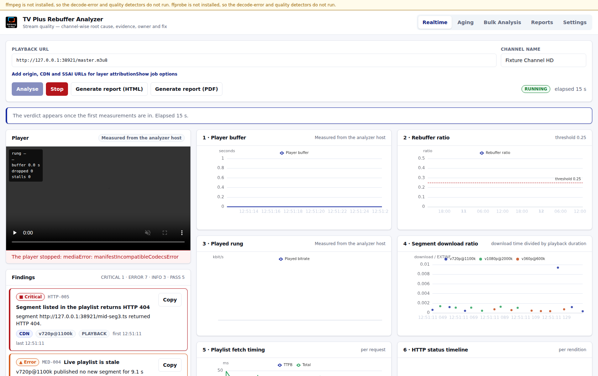
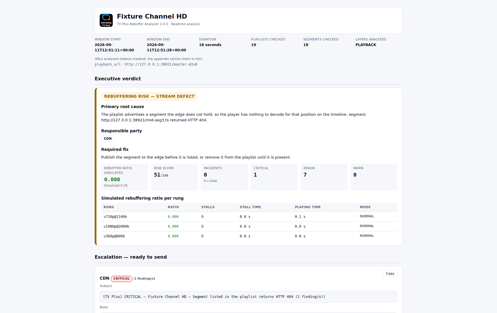
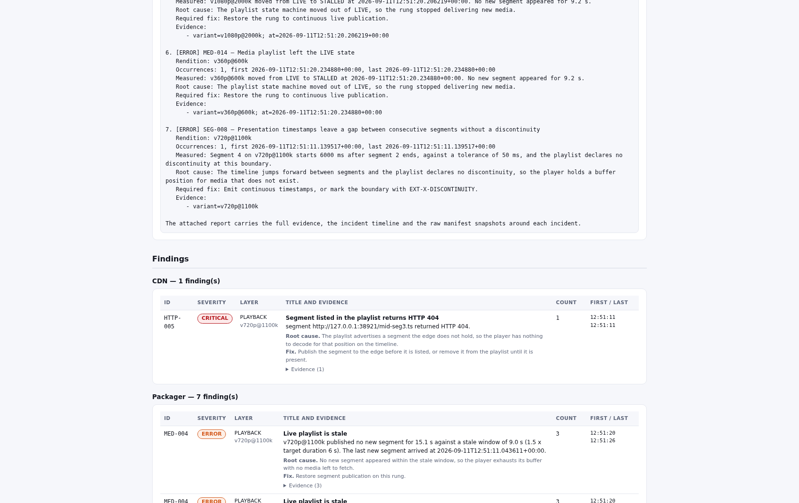
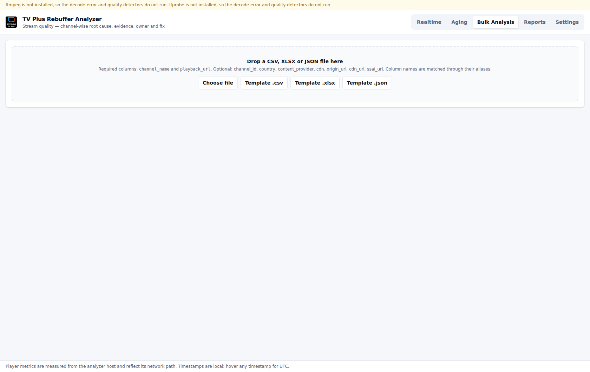

# TV Plus Rebuffer Analyzer (RBA)

Internal platform for the Samsung TV Plus stream quality team.

A linear HLS channel whose rebuffering ratio crosses **0.25** on the TV Plus Tizen player is
flagged as a rebuffering channel. RBA takes that channel's playback URL, analyses the master
playlist, every child playlist, cross-variant consistency, the segments and the audio and
video bitstreams, and produces a channel-wise report that names the **exact defect, the
evidence that proves it, the responsible party, and the fix** — ready to forward to the
content provider, packager, CDN, SSAI vendor, or the Samsung player team.

Every finding is a rule that fired on a measurement. There are no hypotheses in the output:
a unit test fails the build if a hedging word enters a rule, a report template, or the
analysis code.



## What it does

| Tab | Purpose |
|---|---|
| **Realtime** | Paste a playback URL, analyse live. Player, sixteen live charts, live findings feed, report at any moment. Stopping files the run and clears the tab for the next one. |
| **Analysed channels** | Every finished analysis, with its verdict, findings, incidents and reports. Read back from the database, so a channel analysed before the last restart is still here; delete one and its measurements and report files go with it. |
| **Aging** | Put channels under analysis for 15 min to 24 h. Jobs run server-side and survive the browser closing and a backend restart. |
| **Bulk** | Upload CSV / XLSX / JSON of many channels. Snapshot or aging mode, with concurrency control. Consolidated ranked report plus per-channel reports. |
| **Reports** | Every report generated, searchable by channel, date, verdict and owner. |
| **Settings** | Thresholds, User-Agent profile, concurrency limits, retention, and the full rule catalogue. |

Realtime and Aging accept optional **Origin**, **CDN** and **SSAI (MediaTailor)** URLs
alongside the playback URL. When they are present the same checks run on each layer and a
defect is pinned to the first layer it appears on. Without them, each defect is attributed
from its own layer plus the response headers that prove it — and the report says which.

### How a finding reads

Every finding states the measurement, the root cause, the responsible party and the fix:

> **`HTTP-005` Segment listed in the playlist returns HTTP 404** — CRITICAL, CDN, `v720p@1100k`
>
> Segment `https://cdn.example/live/ch1/mid-seg3.ts` returned HTTP 404.
>
> **Root cause.** The playlist advertises a segment the edge does not hold, so the player has
> nothing to decode for that position on the timeline.
>
> **Fix.** Publish the segment to the edge before it is listed, or remove it from the playlist
> until it is present.

## Analysis in brief

- **Collectors.** Every child playlist is polled in parallel at `TARGETDURATION / 2`. The
  lowest, middle and highest video rung and every audio rendition are sampled in full; other
  rungs every Nth segment. The master is re-polled every 20 s and the ladder swept every
  5 min.
- **181 rules** across DNS, TLS, HTTP, CDN, master playlist, media playlist, sequence
  numbers, segments, video bitstream, audio, A/V sync, subtitles, SSAI and player telemetry.
  See [`docs/RULES.md`](docs/RULES.md).
- **Virtual Player Buffer.** A Tizen-like player modelled against the delivery timings
  actually measured, so Aging and Bulk produce a rebuffering ratio with no player attached,
  and Realtime shows the model next to the real hls.js buffer. Three sensitivity modes:
  `STRICT`, `NORMAL`, `OUTAGE_ONLY`.
- **Correlation.** Every stall — real or simulated — is matched to the events measured in
  `[stall_start − 2 × TARGETDURATION, stall_end]` on its rung and rendered as one chain:
  `CDN stale playlist 720p 12:03:02–12:03:20 (MED-004) → segment 48213 listed late → player
  stall 12:03:14, 4.1 s`.
- **Incidents** open only after a condition persists `incident_open_s` and close after
  `incident_clear_s` of clean delivery, so reports list the periods a viewer experienced
  rather than raw event spam.
- **Verdict.** One primary root cause ranked by severity × rebuffer impact × occurrence ×
  stall correlation, the contributing defects, and a 0–100 Rebuffer Risk Score whose formula
  is printed in the report appendix.

## Reports



One Jinja2 template renders the HTML that Playwright prints to PDF, so the two never
diverge. The HTML is self-contained — inline CSS, inlined chart library, base64 logo — so it
can be emailed as a single attachment.

Each report carries the executive verdict, a **ready-to-send escalation block per
responsible party**, the findings grouped by owner with expandable evidence, the incident and
stall-correlation timeline, the charts, the ladder audit, the checks that passed, and an
appendix with the full URLs, redirect chains, layer attribution, manifest snapshots around
each incident, the thresholds used, the risk-score formula and a glossary.



## Quick start

Python 3.11+ and Node 20+ are the only prerequisites. ffmpeg is optional — without it the
decode-error and quality detectors do not run and every other check does. Full instructions,
including the `.env` file and the troubleshooting list, are in
[`docs/SETUP.md`](docs/SETUP.md).

**Linux and macOS**

```bash
make install                            # backend venv + frontend node_modules
cp backend/.env.example backend/.env    # fill in DB_*, or set DB_ENGINE=sqlite
make dev                                # backend on :8010, frontend on :5173
```

**Windows**

```powershell
.\deploy\windows\setup.cmd -Dev         # venv, backend, Playwright, node_modules, .env
.\deploy\windows\rba.cmd dev            # backend on :8010, frontend on :5173
```

`rba.cmd` is the Makefile's counterpart — `dev`, `serve`, `build`, `test`, `lint`, `rules`,
`analyse`, `clean`, `help`. `serve` builds the bundle and serves it on :8080 next to the
backend, which is the Windows stand-in for nginx. Neither script changes the machine's
execution policy, and both refuse port 8001.

Headless, without the UI:

```bash
cd backend
.venv/bin/python -m app.cli analyse "https://cdn.example/live/ch1/master.m3u8" \
    --duration 5m --html out.html --pdf out.pdf
.venv/bin/python -m app.cli rules --markdown > ../docs/RULES.md   # or: make rules
```

```powershell
.\deploy\windows\rba.cmd analyse "https://cdn.example/live/ch1/master.m3u8" --duration 5m --html out.html
```

`analyse` exits `0` when no stream-side defect was found and `2` when one was, so it drops
into a monitoring cron — or a Windows scheduled task — without further glue.

With Docker, on either platform:

```bash
make up             # backend :8010, frontend :8080
```

## Deployment on 107.109.131.68

| Service | Port |
|---|---|
| Backend (uvicorn) | **8010** |
| Frontend (nginx, reverse-proxies `/api` and `/ws`) | **8080** |
| *Reserved — never used by RBA* | 8001 (existing Metanalyser backend) |

Check the host before binding:

```bash
ss -ltnp | grep -E ':(8010|8080)\b'
```

If either port is taken, take the next free one and record it here and in `backend/.env`.
`deploy/install.sh` performs this check itself and stops rather than binding over something.

Frontend build variables:

```
VITE_API_BASE=http://107.109.131.68:8080/api
VITE_WS_BASE=ws://107.109.131.68:8080/ws
```

Without Docker:

```bash
sudo deploy/install.sh      # venv, migrations, frontend build, systemd unit, nginx site
journalctl -u rba-backend -f
```

The systemd unit runs a **single worker on purpose**: jobs are held in process and resumed
from the database on restart, so a second worker would run each aging job twice. It caps
memory at 6 GB, which holds the 20 concurrent aging jobs the analyzer is sized for with
room to spare — the figure the load test in `backend/tests/test_load.py` measures against.

## Database

**Everything RBA records lives in your SQL server** — jobs, findings, incidents, samples,
playlist snapshots, settings, and the rendered reports themselves. The analyzer host keeps
no state of its own, so a second instance serves a report it did not render and nothing is
lost when a container is replaced.

Point it at your server in `backend/.env`:

```
DB_ENGINE=mysql          # mysql | mariadb | postgres | sqlite
DB_HOST=10.0.0.5
DB_PORT=3306
DB_USER=rba
DB_PASSWORD=…
DB_NAME=rba
```

On start RBA creates the `rba` database and its tables, then reports the outcome at
`/api/health` without revealing the host or the user. It never touches another
application's tables. If the account cannot create databases, point `DB_NAME` at an
existing one and set `DB_TABLE_PREFIX=rba_`; every RBA table is then created inside it
under that prefix.

`DB_ENGINE=sqlite` needs nothing else and keeps a single file in `RBA_DATA_DIR` — useful
for a laptop, not for the deployment.

Credentials live only in `backend/.env`, which is git-ignored. `backend/.env.example`
carries the variable names. A `secret-scan` hook aborts any commit that would carry a value
from `.env` into the repository.

**Schema**: `channels`, `jobs`, `bulk_items`, `findings`, `incidents`, `samples_playlist`,
`samples_segment`, `samples_player`, `virtual_buffer`, `playlist_snapshots`, `reports`,
`settings`, each sample table indexed on `(job_id, variant, ts)`. A retention job purges raw
samples past the configured window (30 days by default) while keeping findings, incidents
and reports; snapshots pinned around an incident survive the purge.

**Reports** are stored as bytes in `reports.content` (`LONGBLOB` on MySQL) and streamed from
there. `RBA_REPORT_STORAGE` decides where they go:

| Value | Behaviour |
|---|---|
| `database` | The bytes go in the table and nothing is written to the host. **The default.** |
| `both` | The database, plus a mirrored copy in `RBA_REPORTS_DIR`. |
| `disk` | Files only, as builds before this behaved. |

An HTML report is about 1 MB and a PDF about 250 KB. Bulk archives are assembled in memory
and stored the same way, so a batch of 50 channels produces one row of roughly 20 MB —
raise MySQL's `max_allowed_packet` past that if you run large batches. Evidence archives are
built in memory from the stored rows and streamed, never written out.

Applying the schema to an existing database:

```bash
cd backend && .venv/bin/alembic upgrade head
```

## API

```
POST   /api/realtime/sessions              DELETE /api/realtime/sessions/{id}
WS     /ws/realtime/{id}                   server→client analysis, client→server telemetry
GET    /api/realtime/sessions/{id}/result  interim result while the session runs
GET    /api/realtime/sessions/{id}/manifests
GET    /api/realtime/sessions/{id}/snapshots?variant=&at=   time travel with a diff
POST   /api/realtime/sessions/{id}/report?format=html|pdf

POST   /api/aging/jobs      GET /api/aging/jobs      GET|DELETE /api/aging/jobs/{id}
GET    /api/aging/jobs/{id}/result           GET /api/aging/jobs/{id}/report.{html|pdf}

POST   /api/bulk/jobs       GET /api/bulk/jobs/{id}  POST /api/bulk/validate
GET    /api/bulk/jobs/{id}/report.{html|pdf}         GET /api/bulk/jobs/{id}/reports.zip
GET    /api/bulk/template.{csv|xlsx|json}

GET    /api/reports  ·  GET|DELETE /api/reports/{id}  ·  GET /api/reports/{id}/download
GET    /api/jobs/{id}/evidence.zip   ·  GET /api/jobs/{id}/snapshots?variant=&at=
GET    /api/proxy?u=<urlencoded>
GET|PUT /api/settings   ·  GET /api/settings/rules   ·  GET /api/health
```

Interactive documentation is served at `/api/docs`.

### Bulk input

Required: `channel_name`, `playback_url`. Optional: `channel_id`, `country`,
`content_provider`, `cdn`, `origin_url`, `cdn_url`, `ssai_url`. Column names are matched
case-insensitively through an alias table — `url`, `hls_url`, `m3u8`, `Channel`, `Playback
URL` and similar all resolve — and every row is validated before the job starts, with
row-level errors shown for correction.



## Interface

The application follows one design system, **Signal Clarity**, and the report templates
follow it too, so a PDF sent to a vendor looks like the screen the operator read it on.

- **Structure.** A collapsible dark rail carries the five sections and the host's health.
  Every screen opens with a page header — what this is, what state it is in, who is
  operating it — then a row of measurements, then the evidence. Opening a finding replaces
  the body with its investigation: the causal chain, the request evidence, the failing
  manifest line, and a decision card naming the root cause, the responsible party and the
  required fix, with the escalation text one click away.
- **Colour.** Samsung blue `#1428A0`, violet `#7B2CBF`, TV Plus pink `#FF2D55`, and one
  green `#12864C` for a clean result, on white. The three-stop gradient is reserved for the
  executive verdict and the report header. Severity runs green → blue → violet → pink, and
  colour is never the only signal — every severity carries its own word, and findings carry
  a coloured rail on the card edge.
- **Type.** One UI Sans → SamsungOne → Inter → Arial for the interface. JetBrains Mono →
  Roboto Mono for machine evidence only: manifests, URLs, timestamps, HTTP information,
  identifiers and measured numbers.

Tokens live in `frontend/tailwind.config.js`, component classes in `frontend/src/theme/index.css`,
and primitives in `frontend/src/components/ui/`.

## Documentation

- [`docs/SETUP.md`](docs/SETUP.md) — setup and run instructions for Linux, macOS and
  Windows, the `.env` variables, and what to do when something does not start.
- [`docs/RULES.md`](docs/RULES.md) — the full rule catalogue, generated from the registry by
  `make rules`. CI fails if it drifts from the code.
- [`docs/REFERENCE_TOOLS.md`](docs/REFERENCE_TOOLS.md) — coverage matrix against
  HLSAnalyzer, Qosifire, the Dolby Stream Validator, the Akamai Stream Validator and
  THEOplayer Inspect Stream, with out-of-scope rows carrying their reason. A test fails if
  the matrix names a rule that no longer exists.
- [`CLAUDE.md`](CLAUDE.md) — conventions, commands and the project's non-negotiables.

## Development

```bash
make test      # pytest + vitest
make lint      # ruff, ruff format, mypy, eslint, tsc
make rules     # regenerate docs/RULES.md
```

Tests run against a **fault-injecting fixture origin**: a pure-Python TS muxer and playlist
renderer that place a chosen fault exactly where a rule expects it — a PTS gap of a given
size, an AAC sample-rate change at a given segment, a segment that starts on a non-IDR slice
— served over an HTTP origin that can add redirects, required query tokens, 404s, delays and
wrong content types. No ffmpeg is needed to run the suite.

Every rule has a positive and a negative case, so a rule that stops firing, or starts firing
on a clean stream, fails the build.

## Notes on measurement

Player metrics shown in the Realtime tab are **measured from the analyzer host**. They
reflect the analyzer's network path, not a TV's; the UI labels them so everywhere they
appear. The Virtual Player Buffer is what produces a rebuffering ratio for Aging and Bulk.

TLS verification is disabled on every outbound fetch so a broken chain never blocks analysis.
The certificate chain is still inspected and reported — disabling verification hides nothing.

URLs are used verbatim: every query parameter survives, redirects are followed one hop at a
time so each status, header and timing is recorded, and child URIs resolve against the final
post-redirect URL. A `|COMPONENT=HLS` suffix is stripped before the request.
